# Recurrent Neural Network (RNN) - Educational Implementation in C++

## Overview 
## (Special Thanks to Claude in helping clean up my horribly messy code and documentation!!)

This project implements a simple **Recurrent Neural Network (RNN)** from scratch in C++. It's designed to help you understand:

1. **How RNNs work internally** - every computation is shown step-by-step
2. **Core C++ concepts** - heavily commented code explains the language features
3. **Matrix/Vector operations** - fundamental building blocks of neural networks

## RNN Workflow Overview

```mermaid
flowchart TB
    subgraph INPUT["📥 INPUT"]
        xt["x_t<br/>Word Embedding<br/>(current word)"]
    end

    subgraph MEMORY["🧠 MEMORY (Recurrence)"]
        ht_prev["h_{t-1}<br/>Previous Hidden State<br/>(memory from past)"]
    end

    subgraph WEIGHTS["⚖️ WEIGHT MATRICES"]
        W["W<br/>Input Weights"]
        U["U<br/>Hidden Weights"]
        V["V<br/>Output Weights"]
    end

    subgraph COMPUTATION["🔧 CORE COMPUTATION"]
        Wx["W × x_t"]
        Uh["U × h_{t-1}"]
        sum["➕ Add<br/>W·x_t + U·h_{t-1} + b"]
        relu["⚡ ReLU<br/>f(x) = max(0, x)"]
    end

    subgraph HIDDEN["💾 NEW HIDDEN STATE"]
        ht["h_t<br/>Current Hidden State<br/>(updated memory)"]
    end

    subgraph OUTPUT_CALC["📊 OUTPUT CALCULATION"]
        Vh["V × h_t"]
        softmax["📈 Softmax<br/>Convert to probabilities"]
    end

    subgraph OUTPUT["📤 OUTPUT"]
        yt["y_t<br/>Probability Distribution<br/>(next word prediction)"]
    end

    %% Input flows
    xt --> W
    W --> Wx
    
    ht_prev --> U
    U --> Uh
    
    %% Computation flow
    Wx --> sum
    Uh --> sum
    sum --> relu
    relu --> ht
    
    %% Output flow
    ht --> V
    V --> Vh
    Vh --> softmax
    softmax --> yt
    
    %% Recurrence loop
    ht -.->|"Next time step"| ht_prev

    %% Styling with explicit dark text color for visibility
    style INPUT fill:#e1f5fe,stroke:#01579b,color:#01579b
    style MEMORY fill:#fff3e0,stroke:#e65100,color:#e65100
    style WEIGHTS fill:#f3e5f5,stroke:#7b1fa2,color:#4a148c
    style COMPUTATION fill:#e8f5e9,stroke:#2e7d32,color:#1b5e20
    style HIDDEN fill:#fce4ec,stroke:#c2185b,color:#880e4f
    style OUTPUT_CALC fill:#e0f2f1,stroke:#00695c,color:#004d40
    style OUTPUT fill:#e8eaf6,stroke:#283593,color:#1a237e

    %% Global Node Text Color
    classDef default color:#333,stroke-width:2px;
```



## The RNN Formula

Based on the classic RNN equations from your notes:

```
Hidden State:    h_t = f(W·x_t + U·h_{t-1} + b)
Output:          y_t = softmax(V·h_t + c)
```

Where:
- `x_t` - Input vector at time t (word embedding)
- `h_t` - Hidden state at time t (network's memory)
- `y_t` - Output probability distribution
- `W` - Input-to-hidden weight matrix
- `U` - Hidden-to-hidden weight matrix (the "recurrent" part!)
- `V` - Hidden-to-output weight matrix
- `b, c` - Bias vectors
- `f` - Activation function (ReLU)

## Project Structure

```
rnn_project/
├── rnn.hpp         # Header file - class declarations
├── rnn.cpp         # Implementation - function definitions
├── main.cpp        # Demo program - shows RNN in action
├── Makefile        # Build automation
├── README.md       # This file
└── output/         # CSV files generated when you run (auto-created)
```

## Quick Start

### Build and Run

```bash
# Compile the project
make

# Run the demo
./rnn_demo

# Or do both in one command
make run
```

### Clean Up

```bash
make clean
```

## Understanding the Output

When you run the program, it shows every computation:

1. **Initialization** - Random weights are created and saved
2. **Forward Pass** - For each input in the sequence:
   - Shows the input vector
   - Shows the previous hidden state
   - Computes W·x_t, U·h_{t-1}
   - Adds them together with bias
   - Applies ReLU activation
   - Computes output probabilities

## CSV Files

All intermediate values are saved to `output/`:

| File Pattern | Contents |
|-------------|----------|
| `00_W_weights*.csv` | Input-to-hidden weight matrix |
| `00_U_weights*.csv` | Hidden-to-hidden weight matrix |
| `00_V_weights*.csv` | Hidden-to-output weight matrix |
| `01_1_input_x_t.csv` | Input at time step 1 |
| `01_3_W_times_x.csv` | W·x_t computation |
| `01_4_U_times_h.csv` | U·h_{t-1} computation |
| `01_7_hidden_state*.csv` | New hidden state h_t |
| `01_10_output_y_t.csv` | Output probabilities |

Open these in Excel, Google Sheets, or Python to visualize the math!

## Key C++ Concepts Demonstrated

### 1. Classes and Objects
```cpp
class RNN {
private:
    Matrix W;           // Private data member
public:
    RNN(int inputSize); // Constructor
    Vector forward(const Vector& input); // Member function
};
```

### 2. Vectors (Dynamic Arrays)
```cpp
#include <vector>
using Vector = std::vector<double>;      // 1D array
using Matrix = std::vector<Vector>;       // 2D array (vector of vectors)

Vector v(5, 0.0);  // Create vector of 5 zeros
v[0] = 3.14;       // Access element
v.push_back(2.7);  // Add element
```

### 3. References and Const
```cpp
// Pass by reference (no copy, efficient)
// const prevents modification
Vector matVecMul(const Matrix& mat, const Vector& vec);
```

### 4. File I/O
```cpp
#include <fstream>
std::ofstream file("output.csv");  // Create output file
file << "Hello, file!" << std::endl;
file.close();
```

### 5. Header Guards
```cpp
#ifndef RNN_HPP  // If not defined
#define RNN_HPP  // Define it

// ... class definition ...

#endif           // End of guard
```

## Network Dimensions

The demo uses small dimensions for clarity:

| Parameter | Size | Real-World Size |
|-----------|------|-----------------|
| Input (embedding) | 4 | 100-300 |
| Hidden state | 5 | 128-1024 |
| Output (vocab) | 6 | 30,000+ |

Total parameters: ~75 (vs millions in real models!)

## Exercises to Try

1. **Change dimensions** - Edit `main.cpp` to use different sizes
2. **Add tanh activation** - Implement and use instead of ReLU
3. **Process longer sequences** - Add more words to the input
4. **Track gradient** - Add backward pass for learning
5. **Implement LSTM** - Add gates for better memory

## The Math in Detail

### Matrix-Vector Multiplication

For matrix `A` [m×n] and vector `v` [n]:

```
result[i] = Σ(j=0 to n-1) A[i][j] × v[j]
```

Example:
```
[1 2]   [3]   [1×3 + 2×4]   [11]
[3 4] × [4] = [3×3 + 4×4] = [25]
```

### ReLU Activation

```
ReLU(x) = max(0, x)
```

Turns negative values to 0, keeps positive values unchanged.

### Softmax

```
softmax(x_i) = exp(x_i) / Σ exp(x_j)
```

Converts any values to probabilities that sum to 1.

## Requirements

- C++17 compiler (g++ 8+ or clang++ 7+)
- Standard library only (no external dependencies!)

## Further Learning

- [Stanford CS231n](http://cs231n.stanford.edu/) - Neural network fundamentals
- [Colah's Blog on RNNs](https://colah.github.io/posts/2015-08-Understanding-LSTMs/)
- [C++ Tutorial](https://www.learncpp.com/) - Comprehensive C++ learning

---

Happy learning! 🚀
